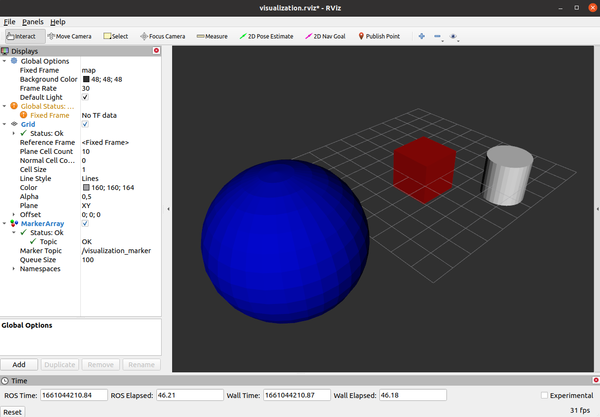

# RViz Object Visualizer
This package takes STL/DAE files from the meshes folder and publishes them as 
visualization_msgs to **RViz**. So you can easily "import" your 3D files into **RViz**.

### Usage
Just launch the ```display.launch``` file to visualize all meshes from the *meshes* 
folder and visualize them as markers in **RViz**. The loading of the meshes is done 
**dynamically**. This means, if you delete or add a file, the visualization will 
update. Just put the files you want to visualize in **RViz** in the *meshes* folder 
and look whats happening. You could either launch the ```display.launch``` file 
or Add *VisualizationMarker* in RViz via the *Add* button.



To test this package just launch the ```display.launch``` file directly after cloning or downloading this package. RViz should popup and visualize the *cube.dae*, *sphere.dae* and *cylinder.stl* file from the *meshes* folder as example.

### Licence
The RViz Object Visualizer source is released under the BSD License.

### Copyright
```
RViz Object Visualizer

Maximilian von Unwerth
von-unwerth.de
Copyright(C) 2022
All rights reserved.
```
